# Arquitectura FirmaVB - Plataforma Integral para Mercado Público

## Visión General

FirmaVB es una plataforma SaaS que automatiza y optimiza la participación de proveedores en Mercado Público de Chile. **Evaristo** es el asistente IA experto en compras públicas que actúa como el "cerebro" integrado en toda la plataforma.

## Stack Tecnológico

### Frontend
- **Framework**: Next.js + React
- **Hosting**: Vercel o similar
- **UI**: Tailwind CSS + shadcn/ui
- **State Management**: React Query + Zustand

### Backend
- **Database**: Supabase (PostgreSQL)
- **API**: Supabase Edge Functions + REST API
- **Auth**: Supabase Auth
- **Storage**: Supabase Storage (documentos, bases técnicas)

### Servicios Externos
- **Mercado Público API**: api.mercadopublico.cl
- **IA (Evaristo)**: Gemini Pro / GPT-4
- **Pagos**: Flow o WebPay
- **Email**: SendGrid o Resend

### Sincronización de Datos
- **Fuente Principal**: API Mercado Público
- **Frecuencia**: 2 veces al día (Compra Ágil), continuo (Licitaciones)
- **Backup/Admin**: Google Sheets (sincronizado con Supabase)

---

## Arquitectura de Datos

### Esquema Base de Datos (Supabase)

```sql
-- USUARIOS Y EMPRESAS
CREATE TABLE empresas (
  id UUID PRIMARY KEY DEFAULT gen_random_uuid(),
  rut VARCHAR(12) UNIQUE NOT NULL,
  razon_social VARCHAR(255) NOT NULL,
  plan_id UUID REFERENCES planes(id),
  fecha_inicio DATE,
  estado VARCHAR(20), -- activo, suspendido, prueba
  created_at TIMESTAMP DEFAULT NOW()
);

CREATE TABLE usuarios (
  id UUID PRIMARY KEY DEFAULT gen_random_uuid(),
  email VARCHAR(255) UNIQUE NOT NULL,
  nombre VARCHAR(255),
  empresa_id UUID REFERENCES empresas(id),
  rol VARCHAR(50), -- admin, vendedor, viewer
  activo BOOLEAN DEFAULT true,
  created_at TIMESTAMP DEFAULT NOW()
);

-- COMPRA ÁGIL
CREATE TABLE compras_agiles (
  id UUID PRIMARY KEY DEFAULT gen_random_uuid(),
  codigo_ca VARCHAR(50) UNIQUE NOT NULL,
  nombre_ca TEXT,
  descripcion TEXT,
  institucion_codigo VARCHAR(20),
  institucion_nombre VARCHAR(255),
  region VARCHAR(100),
  monto_estimado NUMERIC(15,2),
  fecha_publicacion TIMESTAMP,
  fecha_cierre TIMESTAMP,
  estado VARCHAR(50), -- publicada, cerrada, adjudicada, desierta
  categoria VARCHAR(255),
  url_detalle TEXT,
  created_at TIMESTAMP DEFAULT NOW(),
  updated_at TIMESTAMP DEFAULT NOW()
);

-- LICITACIONES
CREATE TABLE licitaciones (
  id UUID PRIMARY KEY DEFAULT gen_random_uuid(),
  codigo_licitacion VARCHAR(50) UNIQUE NOT NULL,
  nombre TEXT,
  descripcion TEXT,
  institucion_codigo VARCHAR(20),
  institucion_nombre VARCHAR(255),
  region VARCHAR(100),
  monto_estimado NUMERIC(15,2),
  fecha_publicacion TIMESTAMP,
  fecha_cierre TIMESTAMP,
  fecha_adjudicacion TIMESTAMP,
  estado VARCHAR(50), -- publicada, cerrada, adjudicada, desierta, revocada
  tipo_compra VARCHAR(100),
  url_ficha TEXT,
  url_bases TEXT,
  created_at TIMESTAMP DEFAULT NOW(),
  updated_at TIMESTAMP DEFAULT NOW()
);

CREATE TABLE items_licitacion (
  id UUID PRIMARY KEY DEFAULT gen_random_uuid(),
  licitacion_id UUID REFERENCES licitaciones(id) ON DELETE CASCADE,
  numero_item INT,
  descripcion TEXT,
  cantidad NUMERIC(15,2),
  unidad VARCHAR(50),
  categoria VARCHAR(255)
);

-- POSTULACIONES (PIPELINE COMERCIAL)
CREATE TABLE postulaciones (
  id UUID PRIMARY KEY DEFAULT gen_random_uuid(),
  empresa_id UUID REFERENCES empresas(id),
  licitacion_id UUID REFERENCES licitaciones(id),
  compra_agil_id UUID REFERENCES compras_agiles(id),
  tipo VARCHAR(20), -- licitacion, compra_agil
  estado VARCHAR(50), -- prospecto, en_preparacion, enviada, en_evaluacion, adjudicada, perdida, desistida
  probabilidad INT, -- 0-100
  vendedor_id UUID REFERENCES usuarios(id),
  monto_ofertado NUMERIC(15,2),
  fecha_revision_bases DATE,
  fecha_preparacion_oferta DATE,
  fecha_envio DATE,
  fecha_cierre DATE,
  fecha_adjudicacion DATE,
  notas TEXT,
  created_at TIMESTAMP DEFAULT NOW(),
  updated_at TIMESTAMP DEFAULT NOW()
);

-- CONFIGURACIONES DE MATCH
CREATE TABLE config_match (
  id UUID PRIMARY KEY DEFAULT gen_random_uuid(),
  empresa_id UUID REFERENCES empresas(id),
  palabras_clave JSONB, -- ["construcción", "ferretería", ...]
  palabras_excluyentes JSONB, -- ["minería", "petrolero", ...]
  regiones JSONB, -- ["RM", "V", "VIII", ...]
  monto_minimo NUMERIC(15,2),
  monto_maximo NUMERIC(15,2),
  umbral_match NUMERIC(3,2), -- 0.0 a 1.0
  pesos_criterios JSONB, -- {"palabra_clave": 0.4, "region": 0.3, "monto": 0.3}
  updated_at TIMESTAMP DEFAULT NOW()
);

-- INSTITUCIONES (SCORING)
CREATE TABLE instituciones (
  id UUID PRIMARY KEY DEFAULT gen_random_uuid(),
  codigo VARCHAR(20) UNIQUE NOT NULL,
  nombre VARCHAR(255) NOT NULL,
  region VARCHAR(100),
  tipo VARCHAR(100), -- ministerio, municipalidad, servicio, etc.
  plazo_pago_promedio INT, -- días
  monto_total_adjudicado NUMERIC(15,2),
  cantidad_licitaciones INT,
  score_pagador NUMERIC(3,2), -- 0.0 a 5.0
  observaciones TEXT,
  created_at TIMESTAMP DEFAULT NOW(),
  updated_at TIMESTAMP DEFAULT NOW()
);

-- LISTA DE PRECIOS
CREATE TABLE lista_precios (
  id UUID PRIMARY KEY DEFAULT gen_random_uuid(),
  empresa_id UUID REFERENCES empresas(id),
  codigo_producto VARCHAR(100),
  descripcion TEXT,
  marca VARCHAR(100),
  costo_unitario NUMERIC(15,2),
  margen_objetivo NUMERIC(5,2), -- porcentaje
  precio_venta NUMERIC(15,2),
  unidad VARCHAR(50),
  categoria VARCHAR(255),
  activo BOOLEAN DEFAULT true,
  updated_at TIMESTAMP DEFAULT NOW()
);

-- PLANES Y FACTURACIÓN
CREATE TABLE planes (
  id UUID PRIMARY KEY DEFAULT gen_random_uuid(),
  nombre VARCHAR(100) NOT NULL,
  descripcion TEXT,
  precio_mensual NUMERIC(10,2),
  max_usuarios INT,
  max_alertas_dia INT,
  frecuencia_actualizacion VARCHAR(50), -- "2x día", "1x día", "semanal"
  modulos_incluidos JSONB, -- ["compra_agil", "licitaciones", "evaristo_comercial", ...]
  activo BOOLEAN DEFAULT true
);

CREATE TABLE facturas (
  id UUID PRIMARY KEY DEFAULT gen_random_uuid(),
  empresa_id UUID REFERENCES empresas(id),
  numero_factura VARCHAR(50),
  fecha_emision DATE,
  fecha_vencimiento DATE,
  monto NUMERIC(10,2),
  estado VARCHAR(50), -- pendiente, pagada, vencida
  pdf_url TEXT,
  created_at TIMESTAMP DEFAULT NOW()
);

-- INTERACCIONES CON EVARISTO
CREATE TABLE conversaciones_evaristo (
  id UUID PRIMARY KEY DEFAULT gen_random_uuid(),
  usuario_id UUID REFERENCES usuarios(id),
  modulo VARCHAR(50), -- compra_agil, licitaciones, postulaciones, gem_legal, etc.
  contexto_id VARCHAR(100), -- ID de la CA, licitación, postulación según módulo
  pregunta TEXT,
  respuesta TEXT,
  perfil_evaristo VARCHAR(50), -- legal, comercial, conservador, audaz
  created_at TIMESTAMP DEFAULT NOW()
);
```

---

## Integración de Evaristo (IA)

### Capacidades de Evaristo

1. **Conocimiento Base**:
   - Ley 19.886 de Compras Públicas
   - Reglamento de Compras
   - Procedimientos de reclamos, recursos y multas
   - Estrategias comerciales para proveedores

2. **Perfiles Configurables**:
   - **Legal**: Cartas de descargo, observaciones a bases, recursos
   - **Comercial**: Argumentos de valor, narrativa pro-empresa, análisis de competencia
   - **Conservador**: Recomienda solo oportunidades de bajo riesgo
   - **Audaz**: Sugiere oportunidades agresivas y estrategias competitivas

3. **Contextos de Uso**:
   - Chat contextual en cada módulo (siempre accesible)
   - Módulo GEM Experto dedicado (generación de documentos legales/comerciales)
   - Recomendaciones automáticas en listados (score, riesgo, sugerencias)

### Arquitectura de Evaristo

```mermaid
graph TD
    U[Usuario en módulo X] -->|Pregunta| FE[Frontend]
    FE -->|POST /api/evaristo| API[Supabase Edge Function]
    API -->|Consulta contexto| DB[(Supabase DB)]
    DB -->|Datos CA/Licitación/Institución| API
    API -->|Prompt + Contexto| IA[Gemini/GPT]
    IA -->|Respuesta| API
    API -->|Guarda conversación| DB
    API -->|Respuesta| FE
    FE -->|Muestra chat| U
```



### Prompt Base de Evaristo

```
Eres Evaristo, un asesor experto en compras públicas de Chile.

CONTEXTO:
- Módulo actual: {modulo}
- Datos relevantes: {contexto_datos}
- Perfil configurado: {perfil} (legal/comercial/conservador/audaz)
- Empresa: {empresa_info}

CONOCIMIENTO:
- Ley 19.886 y su reglamento
- Procedimientos de Mercado Público
- Estrategias comerciales para proveedores

TAREA:
Responde la pregunta del usuario de forma clara, precisa y accionable.
Si es legal, cita artículos. Si es comercial, enfócate en valor y diferenciación.

PREGUNTA DEL USUARIO:
{pregunta}
```

---

## Sincronización de Datos - API Mercado Público

### Endpoints Clave

1. **Compra Ágil**:
   - Endpoint: `https://api.mercadopublico.cl/compraagil/`
   - Frecuencia: **2 veces al día** (08:00 y 15:00 CLT)
   - Proceso:
     1. Fetch todas las compras ágiles publicadas últimas 48h
     2. Upsert en tabla `compras_agiles`
     3. Ejecutar matcher automático para empresas activas
     4. Enviar alertas (email, webhook)

2. **Licitaciones**:
   - Endpoint: `https://api.mercadopublico.cl/licitaciones/`
   - Frecuencia: **Cada 4 horas** (polling)
   - Proceso:
     1. Fetch licitaciones nuevas y actualizaciones de estado
     2. Upsert en tabla `licitaciones`
     3. Fetch items de licitación si es nueva
     4. Ejecutar matcher

3. **Instituciones**:
   - Endpoint: `/organismos/`
   - Frecuencia: **Semanal** (actualización de catálogo)
   - Proceso:
     1. Fetch listado completo
     2. Merge con datos locales de scoring
     3. Actualizar tabla `instituciones`

### Implementación Técnica

**Supabase Edge Function** (Deno) para cada sincronización:

```typescript
// supabase/functions/sync-compra-agil/index.ts
import { serve } from "https://deno.land/std@0.168.0/http/server.ts"
import { createClient } from 'https://esm.sh/@supabase/supabase-js@2'

serve(async (req) => {
  const supabase = createClient(
    Deno.env.get('SUPABASE_URL')!,
    Deno.env.get('SUPABASE_SERVICE_ROLE_KEY')!
  )

  // 1. Fetch desde API Mercado Público
  const response = await fetch('https://api.mercadopublico.cl/compraagil/...')
  const data = await response.json()

  // 2. Transformar y Upsert
  for (const ca of data.items) {
    await supabase.from('compras_agiles').upsert({
      codigo_ca: ca.Codigo,
      nombre_ca: ca.Nombre,
      // ... resto de campos
    })
  }

  // 3. Ejecutar matcher para empresas activas
  const { data: empresas } = await supabase
    .from('empresas')
    .select('id')
    .eq('estado', 'activo')

  for (const empresa of empresas) {
    await fetch('https://tu-dominio.com/api/matcher', {
      method: 'POST',
      body: JSON.stringify({ empresa_id: empresa.id })
    })
  }

  return new Response(JSON.stringify({ success: true }))
})
```

**Cron Jobs** (GitHub Actions o Supabase Cron):

```yaml
# .github/workflows/sync-data.yml
name: Sync Mercado Público Data

on:
  schedule:
    - cron: '0 11,18 * * *' # 08:00 y 15:00 CLT (UTC-3)

jobs:
  sync-compra-agil:
    runs-on: ubuntu-latest
    steps:
      - name: Trigger Supabase Function
        run: |
          curl -X POST https://tu-proyecto.supabase.co/functions/v1/sync-compra-agil \
            -H "Authorization: Bearer ${{ secrets.SUPABASE_ANON_KEY }}"
```

---

## Alternativa: Google Sheets como Interfaz Admin

Para catálogos editables (instituciones, lista de precios, configuraciones de match), puedes usar:

1. **Google Sheets** como interfaz editable
2. **Supabase** como fuente de verdad
3. **Conector bidireccional** (Apps Script o BuildShip)

### Flujo:


**Apps Script** (ejemplo para instituciones):

```javascript
function syncInstituciones() {
  const sheet = SpreadsheetApp.getActiveSpreadsheet().getSheetByName('Instituciones')
  const data = sheet.getDataRange().getValues()
  
  const supabaseUrl = 'https://tu-proyecto.supabase.co'
  const supabaseKey = 'tu-service-role-key'
  
  for (let i = 1; i < data.length; i++) {
    const row = data[i]
    const payload = {
      codigo: row[0],
      nombre: row[1],
      score_pagador: row[2],
      // ...
    }
    
    UrlFetchApp.fetch(`${supabaseUrl}/rest/v1/instituciones`, {
      method: 'POST',
      headers: {
        'apikey': supabaseKey,
        'Content-Type': 'application/json',
        'Prefer': 'resolution=merge-duplicates'
      },
      payload: JSON.stringify(payload)
    })
  }
}
```

---

## Diagrama de Arquitectura General

```mermaid
graph TB
    subgraph "Frontend (Next.js)"
        UI[UI Components]
        CHAT[Chat Evaristo]
    end
    
    subgraph "Backend (Supabase)"
        API[Edge Functions]
        DB[(PostgreSQL)]
        AUTH[Auth]
        STORAGE[Storage]
    end
    
    subgraph "Servicios Externos"
        MPAPI[API Mercado Público]
        IA[Gemini/GPT]
        PAYMENT[Flow/WebPay]
        EMAIL[SendGrid]
    end
    
    subgraph "Admin Tools"
        SHEETS[Google Sheets]
    end
    
    UI -->|REST/GraphQL| API
    CHAT -->|Pregunta| API
    API -->|Query| DB
    API -->|Prompt| IA
    API -->|Cobro| PAYMENT
    API -->|Notificación| EMAIL
    API -->|Fetch datos| MPAPI
    SHEETS <-->|Sync| DB
    
    MPAPI -->|Cron 2x día| API
```



---

## Próximos Pasos

1. ✅ Definir arquitectura técnica
2. 🔄 **Diseñar wireframes de cada módulo** (siguiente documento)
3. Implementar base de datos en Supabase
4. Desarrollar Edge Functions para sync API
5. Construir frontend con Next.js
6. Integrar Evaristo (Gemini)
7. Testing y ajuste de matchers
8. Deploy y onboarding de primeros clientes
